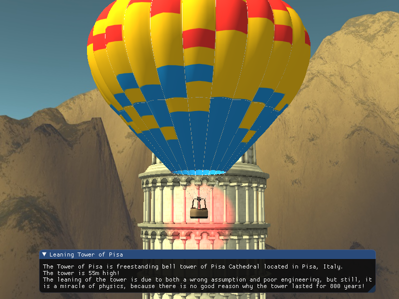
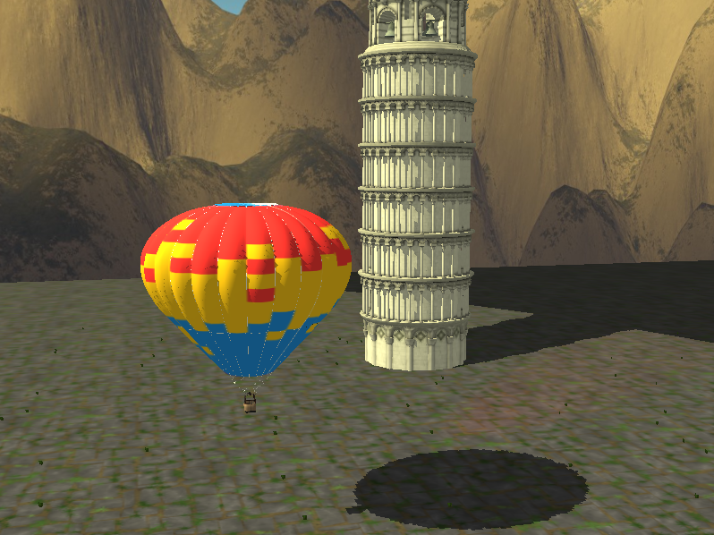

## AirGasBag

### University project for the purpose of the Computer Graphics course.
Try to fly around and find out some interesting facts about structures around you!  
["Gameplay"(VIDEO) Link](https://www.youtube.com/watch?v=niJVVbTmszc)

  
  

## KEYBINDS:
`W` - Forward(toward positive Z axis)  
`S` - Backawrd((toward negative Z axis)  
`A` - Left(toward positive X axis)  
`D` - Right(toward negative X axis)  
`SPACE` - Up  
`SHIFT` - Down  
`~` - Settings (console window)  
`F1` - Enable shadows  
`ESC` - Exit  
## Mouse:
`MOUSE` - Rotate the camera  
`MOUSE Scroll` - Zoom  

## Implemented:
- Mandatory:
   - [x] [Lessons 1-8.](https://matf-racunarska-grafika.github.io/materijali/) 
   - [x] [Blending](https://learnopengl.com/Advanced-OpenGL/Blending)
   - [x] [Face culling](https://learnopengl.com/Advanced-OpenGL/Face-culling)
   - [x] [Advanced lighting](https://learnopengl.com/Advanced-Lighting/Advanced-Lighting)  
- Group A:
   - [x] [Cubemaps](https://learnopengl.com/Advanced-OpenGL/Cubemaps)  
- Group B:
   - [x] [Point shadows](https://learnopengl.com/Advanced-Lighting/Shadows/Point-Shadows)  
